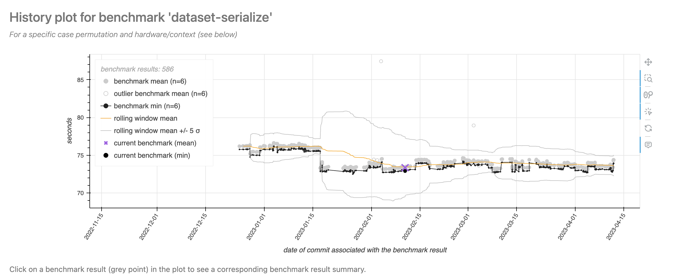
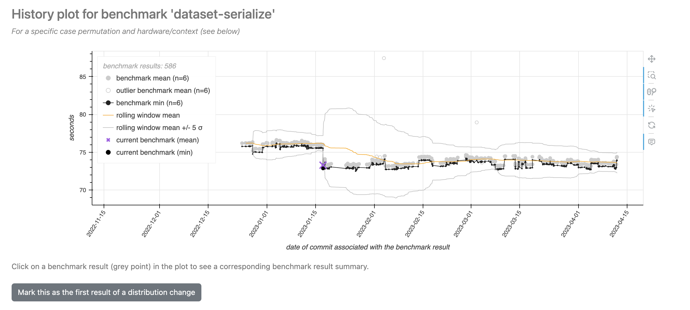
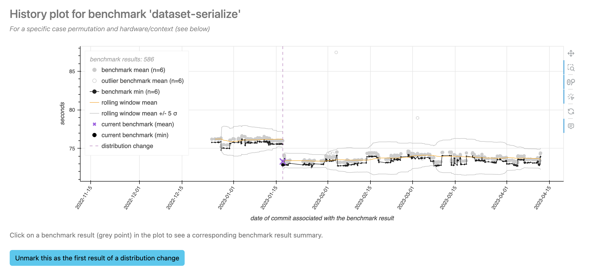

# The "lookback z-score method" of benchmark result analysis

A core value of Conbench is the ability to compare incoming benchmark results with historic results to make data-driven decisions about performance.
The primary method of doing this in Conbench is the "lookback z-score" analysis.
This page describes how that process works.

## Overview

The lookback z-score analysis assigns a numeric z-score value to a benchmark result that represents how consistent the result is in the context of the historic distribution of similar results.
Coupled with a threshold, this can be used to determine whether the benchmark result is indicative of a performance regression or improvement.
For example, if a result is very far from the historical distribution and takes longer, that is indicative of a performance regression.

## Choosing the historic distribution of results

When scoring a contender benchmark result, in order to control for variables that don't have to do with actual performance changes, each result in the historic distribution must share the contender's:

- repository
- hardware
- case permutation
- context

Results with errors will not be included, even if they also have data.

Additionally, when using the lookback z-score method, one must provide a baseline commit (or baseline result or baseline run, which is ultimately associated with a baseline commit).
The historic distribution will be drawn from all runs on commits in the baseline commit's git ancestry, up to and including all runs on the baseline commit itself.
The maximum number of commits used is defined by the Conbench server's `DISTRIBUTION_COMMITS` parameter, which defaults to 100.
In certain cases, there will be fewer than this number: if there are not that many commits in the ancestry, or if a distribution change was annotated by someone acting as a data curator -- see below for more details.

In some cases (e.g. navigating the UI, or generating alerts with the `benchalerts` library), Conbench will provide the user with a sensible baseline commit.
See [the docs](https://conbench.github.io/conbench/pages/benchmarking_and_the_dev_process.html) for the reasoning about this.

- If the contender is on a PR branch, the sensible baseline commit is the point at which the PR branch forked from the default branch.
- If the contender is on the default branch, the sensible baseline commit is the parent commit.
- If the contender is not associated with the git graph for some reason, the sensible baseline commit is the latest commit on the default branch that has benchmark results.

If there are no matching results on the baseline commit, that's alright - the analysis will still include matching results from the git history.
If there are multiple results on the baseline commit (from different runs, etc.), all of them will be used.

## Manually curating the distribution

Even after controlling for contextual variables, sometimes in a project's history there is an _actual_ performance improvement or regression because of a code change.
It is important to flag these changes to the server, so that the server doesn't mix data from before the change with data from after the change, causing artificially-inflated variance that causes false negatives in the lookback z-score analysis.
To do so:

Ensure you have an account for the Conbench instance.
Log in to your account in the webapp via the `Login` button in the top right.
Navigate to a benchmark result page with a plot that indicates a shift in the "true" benchmark mean.

Notice the shift in mean in mid-January, and how the boundaries blow up afterwards.

Click on the first benchmark result AFTER this visual shift, and follow the link that pops up to go to its page.
Since you are logged in, you should see the button that allows you to mark this distribution change.

Upon clicking the button, the change will permanently be stored in the database.
Other users will be able to see this change as well, but you can revert the change by clicking the button again.

Notice how the ±5 standard-deviation boundaries have changed!
The plot now knows that the data after the distribution change should have a different mean than before the distribution change, and so the algorithm works slightly differently.

## Creating the z-score

To create a z-score, Conbench must calculate the mean and standard deviation of the historic result distribution.
Before doing so, outliers are automatically excluded from the distribution.
Documentation on this process is coming soon.

After outliers are excluded, the remaining data is sorted by commit timestamp.
For each benchmark result, Conbench uses the mean of all the result's iterations.
Then:

- the rolling mean is calculated (with the window boundaries as described above)
- the residual of each result's mean from the rolling mean is calculated
- the standard deviation of the residuals is calculated, using Bessel's correction

Then the z-score is the difference of the distribution's mean from the contender result's mean, divided by the standard deviation of the residuals.
The sign is modified depending on the unit, such that a positive z-score indicates a performance improvement and a negative z-score indicates a performance regression.

See below for details of why the standard deviation of the residuals is used.

### How curating the data affects the algorithm

When calculating the rolling mean, Conbench respects each annotated distribution change.
That is, the center of the distribution will completely be reset each time you annotate a change.

However, Conbench makes the assumption that the "spread" of the data will not change much before and after an annotated change.
This assumption is not very risky, and provides the benefit that Conbench can immediately estimate the center and spread of the new distribution upon only one new value's arrival.
This results in fewer false positives in the time period after a distribution change.

This is also the reason why Conbench takes the standard deviation of the residuals of the data from the rolling mean, instead of the raw data itself: we assume the residuals will have a similar spread before and after each change (and mathematically, their spread is equal to the spread of the raw data).

See discussion at [conbench#473](https://github.com/conbench/conbench/issues/473).
